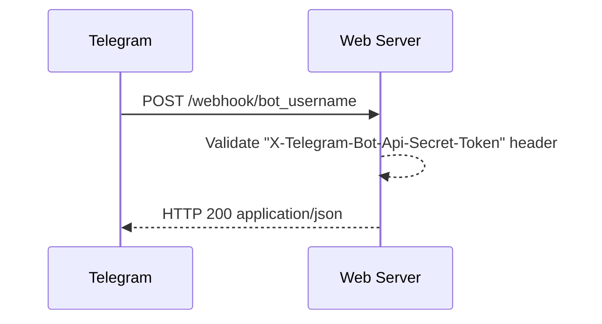
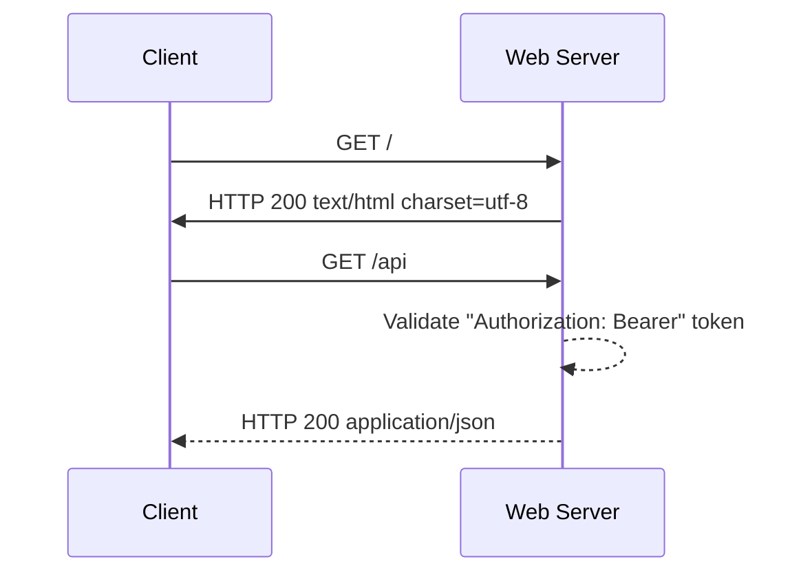

# waitlist

A simple web service for using as a placeholder for your future awesome telegram bot projects

## Setup

```
go mod download
make .
```

## Roadmap

no milestones yet

### Features

- [x] handle POST request from telegram bot api
- [x] allow user to join waitlist
- [x] respond to healthcheck ping
- [x] serve single-page application at the root `/` path

### NFR

- [x] support `X-Telegram-Bot-Api-Secret-Token` to avoid security issues
- [x] save payload along with user data
- [x] protect API with JWT-authorization
- [ ] protect API with rate-limiter
- [x] automated deployments


### Usecases

Server handles request from Telegram and saves entry into database



Authorized user can get entries via API

